# SORCERY

## I. DESCRIPTION

 * Eight of your fellow sorcerers have been imprisoned by an evil and powerful necromancer. 
 * Your task is to find and free them within the time allowed. Once you have done so, you join them in the sanctuary and the game ends.
 * As you would expect, there are a number of baddies out to stop you, locked doors to slow you down and some of the geography doesn't help either.

### Entities   
|Picture|Name|Comments|
|---|---|---|
|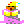|Wizard|main player|
|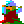|Prisoner|8 to be freed, Frank, Bill, Fred, Sam, Bob, Jim, Mick and Joe|
|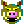|Boar|Ennemy vulnerable to Ball&Chains|
||Eye|Ennemy vulnerable to Ball&Chains|
||Mask|Ennemy vulnerable to Ball&Chains|
||Ghost|Ennemy vulnerable to Sharp Axe|
|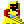|Monk|Ennemy vulnerable to Strong Sword| 
|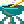|Chauldron|Help revive HP, but some are traps|   

PS: all ennemies are vulnerable to Shooting Star & Sack of Spells

### Items   
|Picture|Name|Comments|
|---|---|---|
||Spell Book|item to free a prisoner|
|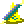|Magic Wand|item to free a prisoner|
||Golden Chalice|item to free a prisoner|
|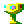|Goblet Of Wine|item to free a prisoner|
||Sorcerer's Moon|item to free a prisoner|
|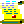|Scroll|item to free a prisoner|
|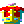|Jewelled Crown|item to free a prisoner|
||Little Lyre|item to free a prisoner|

### Doors and Lock
|Picture|Name|Comments|
|---|---|---|
|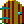|Door| |
|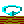|Horizontal Lock|locked trap|
||Vertical Lock|locked trap|
|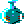|Large Bottle|item to open lock|
||Coat Of Arm|item to open lock|
|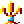|Candelstick|item to open lock|

### Weapons
|Picture|Name|Comments|
|---|---|---|
||Shooting Star|Kills all monsters|
|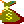|Sack of Spell|Kills all monsters|
|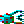|Ball & Chain|Kills Eyes, Mask and Boar|
||String Sword|Kills Monks|
|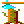|Sharp Axe|Kills Ghosts|

## II. FILE STRUCTURE

 * Assets with currently cpc version of spritesheets. Could be referenced by different game versions.
 * Javascript NodeJS / Phaser 3 version here: [sorceryjs](./soceryjs/README.md)

## III. REFERENCES
 * [www.cpc-power.com](https://www.cpc-power.com/index.php?page=detail&onglet=dsk&num=1988)
 * [www.spriters-resource.com/](https://www.spriters-resource.com/amstrad_cpc/sorcery/)   
 * [Sorcery Plus Test](https://cpcrulez.fr/GamesTest/sorcery_plus.htm)   
 * [Sorcery Solution Walktrhough](https://jeux.dokokade.net/2018/05/31/soluce-retrocompatible-sorcery-et-sorcery-amstrad-cpc/)